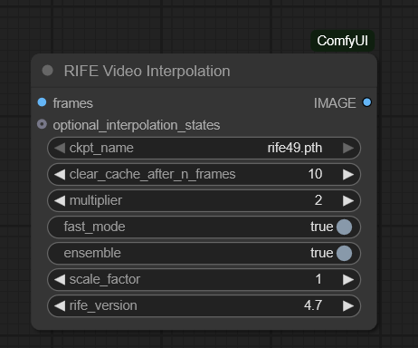
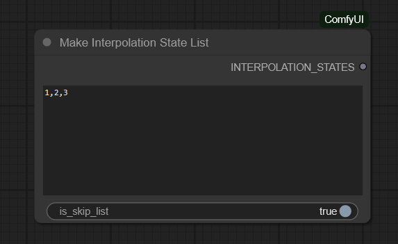

# RIFE for ComfyUI

ComfyUI implementation of RIFE (Real-Time Intermediate Flow Estimation) - High-quality video frame interpolation using optical flow.

Based on code from:
- [Fannovel16/ComfyUI-Frame-Interpolation](https://github.com/Fannovel16/ComfyUI-Frame-Interpolation)
- [hzwer/Practical-RIFE](https://github.com/hzwer/Practical-RIFE)

## Key Differences from Original Version

This implementation includes several improvements:
- **Standard ComfyUI `folder_paths` API** - Uses native ComfyUI model management instead of custom paths
- **Removed automatic model downloader** - Users have full control over model files
- **Simplified configuration** - No external YAML config files required
- **Architecture version selector** - Manual selection of RIFE version for any model checkpoint
- **Streamlined codebase** - All utilities consolidated into single module

## Overview

RIFE (Real-Time Intermediate Flow Estimation) is a state-of-the-art neural network for video frame interpolation. It generates smooth intermediate frames between existing video frames using optical flow estimation, enabling frame rate conversion and slow-motion effects with high temporal consistency.

### Available Nodes

#### RIFE Video Interpolation


The main node for video frame interpolation. Processes input frame sequences and generates intermediate frames using the RIFE neural network with configurable architecture versions and processing parameters.

#### Make Interpolation State List


Optional utility node for selective frame interpolation. Create lists of frame indices to skip or exclusively interpolate, useful for preserving specific keyframes or handling scene cuts.

### Key Features

- **Multiple RIFE Versions**: Support for architectures 4.0, 4.2, 4.3, 4.5, 4.6, 4.7, and 4.10
- **Flexible Model Loading**: Use any checkpoint file with manual architecture selection
- **Fast Mode**: Skip refinement network for faster processing
- **Ensemble Mode**: Average bidirectional flow for improved quality
- **Scale Control**: Process at different resolutions (0.25x to 4.0x)
- **Selective Interpolation**: Skip specific frames or process only selected ranges
- **Memory Management**: Automatic CUDA cache clearing to prevent OOM errors

## Installation

### Prerequisites

- ComfyUI (latest version recommended)
- Python 3.10+
- NVIDIA GPU with CUDA support (recommended)
  - Minimum 6GB VRAM for standard use
  - 8GB+ VRAM recommended for high-resolution frames

### Installation Steps

1. Navigate to your ComfyUI custom nodes directory:
```bash
cd ComfyUI/custom_nodes
```

2. Clone this repository:
```bash
git clone https://github.com/NeuroWaifu/ComfyUI.Node.RIFE.git
```

3. Download RIFE model weights:

Create a `RIFE` folder in your ComfyUI models directory and download models from:
- [Community Models](https://github.com/styler00dollar/VSGAN-tensorrt-docker/releases)

Recommended models:
- `rife47.pth` - Latest stable version (use with version 4.7)

Place models in: `ComfyUI/models/RIFE/`

## Usage

### Basic Workflow

1. In ComfyUI, locate the **RIFE** node in the node menu under the RIFE category
2. Connect your input frames (IMAGE tensor) to the node
3. Configure the following parameters:
   - **Model**: Select your downloaded RIFE checkpoint
   - **RIFE Version**: Choose architecture version matching your model
   - **Multiplier**: Frame multiplication factor (2x doubles frame count)
   - **Fast Mode**: Enable for faster processing (slight quality reduction)
   - **Ensemble**: Enable for better quality (slower processing)
   - **Scale Factor**: Resolution scaling (1.0 = original resolution)

### Advanced Usage with Selective Interpolation

For skipping specific frames or handling scene cuts:

1. Add the **Make Interpolation State List** node to your workflow
2. Configure frame indices (comma-separated): `0,5,10,15`
3. Set **is_skip_list**:
   - `True`: Skip interpolation for listed frames
   - `False`: Only interpolate listed frames
4. Connect to the RIFE node's `optional_interpolation_states` input

### Recommended Settings

#### For 2x Frame Rate (60fps from 30fps):
- Multiplier: 2
- Fast Mode: False
- Ensemble: True
- Scale Factor: 1.0

#### For 4x Slow Motion:
- Multiplier: 4
- Fast Mode: False
- Ensemble: True
- Clear Cache: 5-10 frames

#### For Real-time Preview:
- Multiplier: 2
- Fast Mode: True
- Ensemble: False
- Scale Factor: 0.5

## Parameters

### RIFE Node

| Parameter | Type | Default | Range | Description |
|-----------|------|---------|-------|-------------|
| ckpt_name | COMBO | Required | - | RIFE model checkpoint file |
| frames | IMAGE | Required | - | Input video frames tensor |
| clear_cache_after_n_frames | INT | 10 | 1-1000 | CUDA cache clearing frequency |
| multiplier | INT | 2 | 1+ | Frame multiplication factor |
| fast_mode | BOOLEAN | True | - | Skip refinement network |
| ensemble | BOOLEAN | True | - | Average bidirectional flow |
| scale_factor | COMBO | 1.0 | 0.25-4.0 | Resolution scaling factor |
| rife_version | COMBO | 4.7 | - | Neural network architecture version |
| optional_interpolation_states | Optional | None | - | Selective frame processing |

### Make Interpolation State List Node

| Parameter | Type | Default | Description |
|-----------|------|---------|-------------|
| frame_indices | STRING | "1,2,3" | Comma-separated frame indices |
| is_skip_list | BOOLEAN | True | True=skip listed frames, False=only process listed |

## Architecture Versions

RIFE supports multiple architecture versions. Choose the version that matches your model:

| Version | Compatible Models | Features |
|---------|------------------|----------|
| 4.0 | 4.0, 4.1 | Original architecture with contextnet + unet |
| 4.2 | 4.2 | Improved flow estimation |
| 4.3 | 4.3, 4.4 | Enhanced temporal consistency |
| 4.5 | 4.5 | Residual convolution blocks |
| 4.6 | 4.6 | Optimized memory usage |
| 4.7 | 4.7, 4.8, 4.9 | Feature encoder additions |
| 4.10 | 4.10, 4.11, 4.12 | Latest architecture improvements |

## Performance Tips

1. **Memory Management**:
   - Reduce `clear_cache_after_n_frames` if experiencing OOM errors
   - Lower `scale_factor` for high-resolution inputs
   - Process videos in smaller batches

2. **Quality vs Speed**:
   - **Best Quality**: `fast_mode=False`, `ensemble=True`
   - **Balanced**: `fast_mode=False`, `ensemble=False`
   - **Fast**: `fast_mode=True`, `ensemble=False`

3. **Multiplier Selection**:
   - Higher multipliers increase processing time exponentially
   - Use `multiplier=2` for standard frame doubling
   - `multiplier=4` or higher recommended only for slow-motion effects

4. **Scale Factor**:
   - `scale_factor=1.0`: Best quality, highest VRAM usage
   - `scale_factor=0.5`: Faster processing, lower quality
   - `scale_factor=2.0`: Upscale while interpolating (experimental)

## Troubleshooting

### Out of Memory (OOM) Errors

1. Reduce `clear_cache_after_n_frames` to 5 or lower
2. Lower `scale_factor` to 0.5 or 0.25
3. Process fewer frames at once
4. Disable `ensemble` mode
5. Close other GPU applications

### Poor Output Quality

1. Ensure you're using the correct RIFE version for your model
2. Enable `ensemble` mode for better quality
3. Disable `fast_mode` for refinement processing
4. Use `scale_factor=1.0` for native resolution
5. Check input frame quality and consistency

### Artifacts or Ghosting

1. Use selective interpolation to skip scene cuts
2. Enable `ensemble` mode for better motion estimation
3. Try different RIFE architecture versions
4. Reduce `multiplier` for complex motion scenes

### Slow Performance

1. Enable `fast_mode` to skip refinement
2. Increase `clear_cache_after_n_frames` if not hitting OOM
3. Use lower `scale_factor` for processing
4. Disable `ensemble` mode
5. Ensure CUDA and PyTorch are properly configured

## Model Compatibility

RIFE models are architecture-specific. When downloading models:

1. Check the model version (e.g., rife47 = version 4.7)
2. Select matching architecture in the node
3. For custom/renamed models, refer to original source for version info
4. Default version 4.7 works with most modern models

## Acknowledgments

- Original RIFE implementation by Zhewei Huang et al.
- ComfyUI integration based on Fannovel16's Frame Interpolation pack
- RIFE architecture from Practical-RIFE project
- ComfyUI framework by comfyanonymous

## Links

- [RIFE Paper](https://arxiv.org/abs/2011.06294)
- [Official RIFE Repository](https://github.com/hzwer/Practical-RIFE)
- [Original ComfyUI Integration](https://github.com/Fannovel16/ComfyUI-Frame-Interpolation)

## License

This implementation follows the license of the original RIFE project. Please refer to the upstream repositories for detailed license information.
